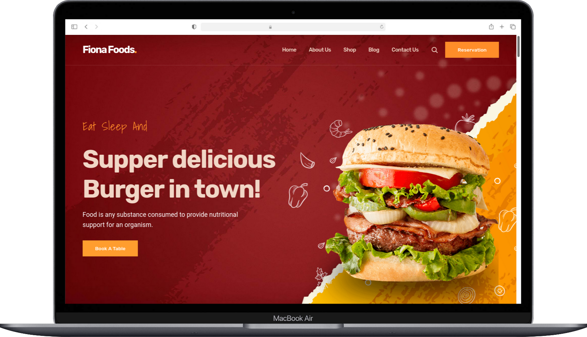
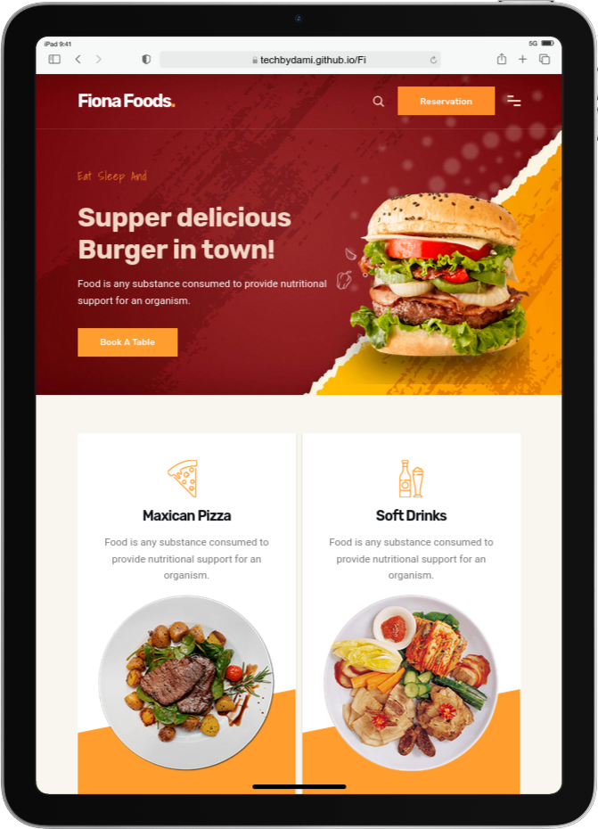
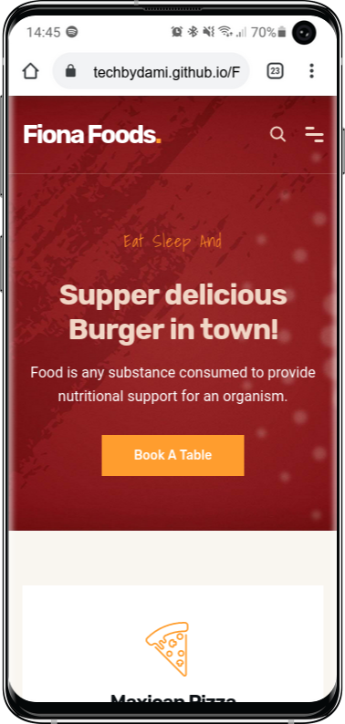

  <h2 align="center">Fiona Foods - Fast food website</h2>

  Fiona Foods is a fully responsive fast food website,  Responsive for all devices, build using HTML, CSS, and JavaScript.

  <a href="https://techbydami.github.io/Fiona_Foods/"><strong>➥ Live Demo of Project</strong></a>

 

### Fiona Foods Demo Screenshots

### License

MIT license.

&copy; 2022 codewithsadee

---

<h3 align="left">Connect with me:</h3>

<a href="https://hashnode.com/@techbydami" target="blank"><img align="center" src="https://raw.githubusercontent.com/rahuldkjain/github-profile-readme-generator/master
